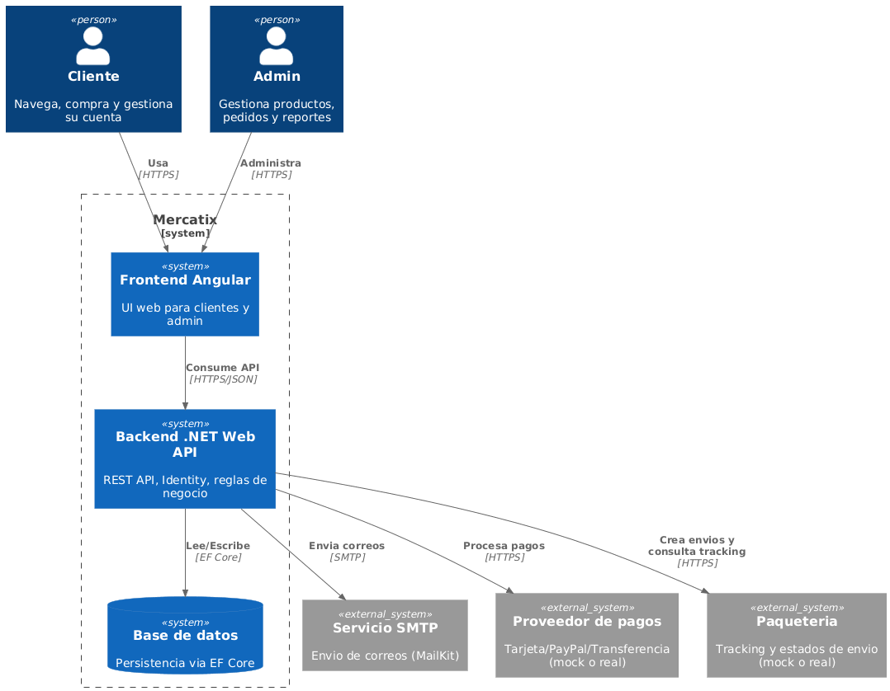
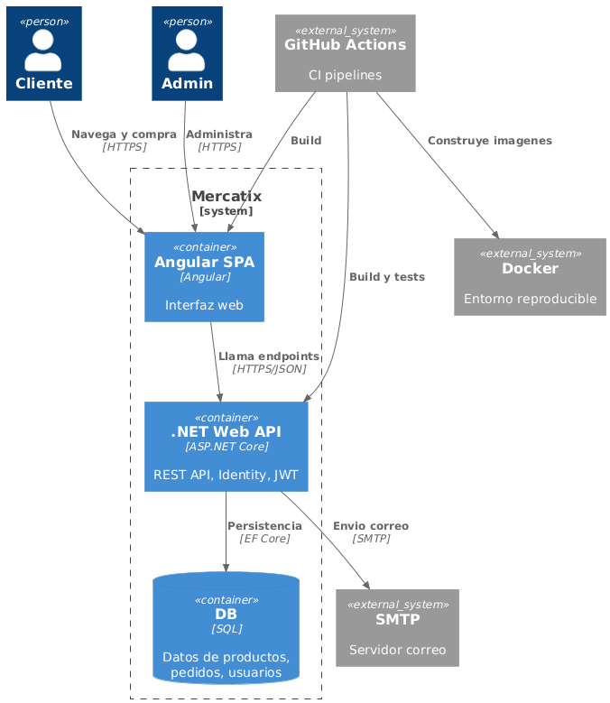
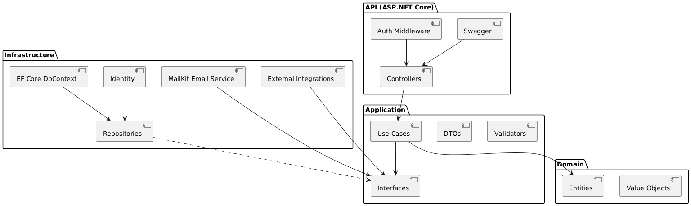
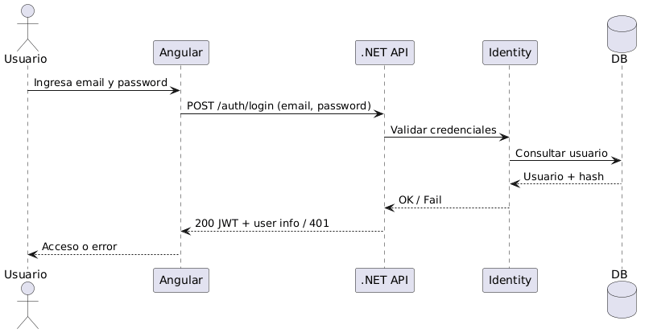
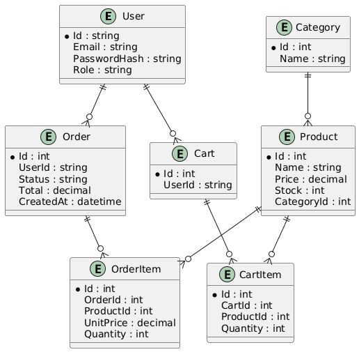

# Descripción General de la Arquitectura

Este documento describe la arquitectura general y las decisiones de diseño del proyecto

---

## 1. Visión General del Sistema

Este proyecto es una aplicación web full-stack construida con las siguientes tecnologías:

- **Frontend:** Angular  
- **Backend:** ASP.NET Core Web API  
- **Base de datos:** Base de datos SQL usando Entity Framework Core  
- **Autenticación:** ASP.NET Identity con JWT  
- **DevOps:** Docker y GitHub Actions  

El sistema sigue una clara separación de responsabilidades entre el frontend, el backend y la infraestructura

---

## 2. Estilo de Arquitectura

El backend sigue los principios de **Arquitectura onion (Onion Architecture)**

Los principales objetivos de esta arquitectura son:

- Separación de responsabilidades  
- Alta capacidad de pruebas  
- Bajo acoplamiento entre capas  
- Reglas de dependencia claras  

Las dependencias siempre apuntan hacia adentro, hacia la capa de Dominio

---

## 3. Estructura del Proyecto Backend

El backend está organizado en las siguientes capas:

### Dominio
Contiene las entidades principales del negocio y las reglas de negocio
Esta capa no tiene dependencias de frameworks externos

### Aplicación
Contiene la lógica de la aplicación, los casos de uso y las interfaces de servicios
Coordina la comunicación entre el Dominio y la Infraestructura.

### Infraestructura
Contiene las implementaciones de dependencias externas, como:

- Acceso a base de datos (EF Core)  
- Identity  
- Servicios de correo electrónico  
- Integraciones externas  

### API
Expone la funcionalidad de la aplicación a través de endpoints HTTP
Gestiona la validación de solicitudes, la autenticación y el formato de las respuestas

---

## 4. Arquitectura del Frontend

El frontend está construido con Angular y sigue una estructura modular

Responsabilidades principales:

- Renderizado de la interfaz de usuario  
- Interacción con el usuario  
- Gestión del estado  
- Comunicación con la API del backend mediante HTTP  

---

## 5. Flujo de Datos

Una solicitud típica sigue el siguiente flujo:

1. El usuario interactúa con la interfaz Angular  
2. Angular envía una solicitud HTTP a la API  
3. La API valida la solicitud y la autenticación  
4. La capa de Aplicación procesa el caso de uso  
5. La capa de Infraestructura interactúa con la base de datos  
6. La respuesta se devuelve al frontend  

---

## 6. Autenticación y Autorización

La autenticación se gestiona utilizando ASP.NET Identity y tokens JWT

- Los usuarios se autentican mediante el endpoint de inicio de sesión  
- Los tokens JWT se emiten tras una autenticación exitosa  
- Angular almacena el token de forma segura  
- Los endpoints protegidos requieren tokens JWT válidos  
- La autorización basada en roles se aplica para funcionalidades de administrador  

---

## 7. Persistencia de Datos

La aplicación utiliza Entity Framework Core con un enfoque **Code First**

- `DbContext` gestiona el acceso a la base de datos  
- Las entidades representan las tablas de la base de datos  
- Las migraciones se utilizan para versionar los cambios en la base de datos  

---

## 8. DevOps y CI/CD

El proyecto incluye pipelines de CI utilizando GitHub Actions

Los pipelines incluyen:

- Compilación y pruebas del backend  
- Compilación del frontend  
- Construcción de imágenes Docker  

Docker se utiliza para garantizar entornos consistentes en desarrollo y despliegue

---

## 9. Mejoras Futuras...

Las posibles mejoras futuras incluyen:

- Caché usando Redis  
- Mejora del registro de logs y la monitorización  
- Optimizaciones de rendimiento  
- Refuerzo avanzado de la seguridad  

## Diagramas

### CONTEXTO

### CONTENEDORES

### BACKEND COMPONENTS

### LOGIN con JWT

### BASE DE DATOS

